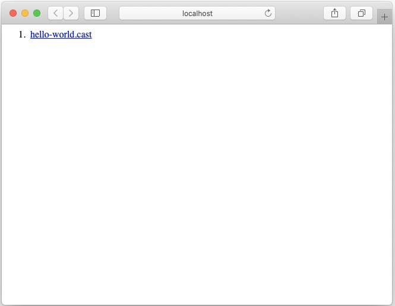
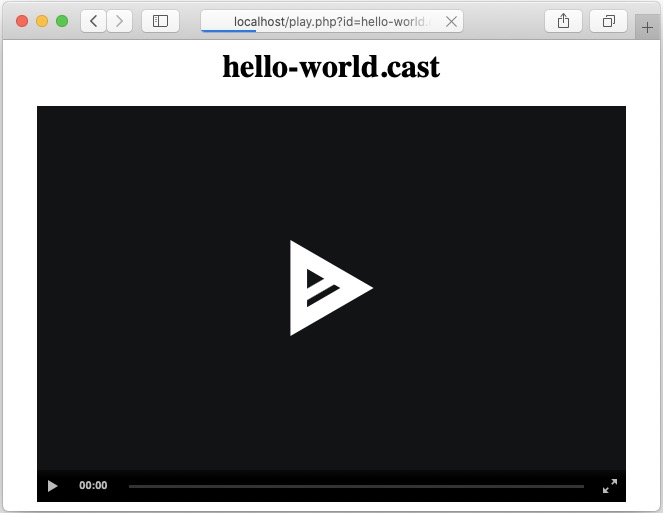

# asciinema-indexer

## Demo




## Motivation

[asciinema](https://asciinema.org/) 是一个 terminal 录屏神器，体积小，且可支持浏览器播放。

通过增加一个简单的 `index.php` 来实现 list 和 play 的功能。

## Description

将 cast 文件统一以 `.cast` 后缀命名，并放入 `casts/` 目录挂载到容器中即可。

## Usage

```
docker run --rm -p 80:8080 -v `pwd`/casts:/var/www/html/casts deagon/asciinema-indexer
```

## Reference

https://hub.docker.com/repository/docker/deagon/asciinema-indexer
